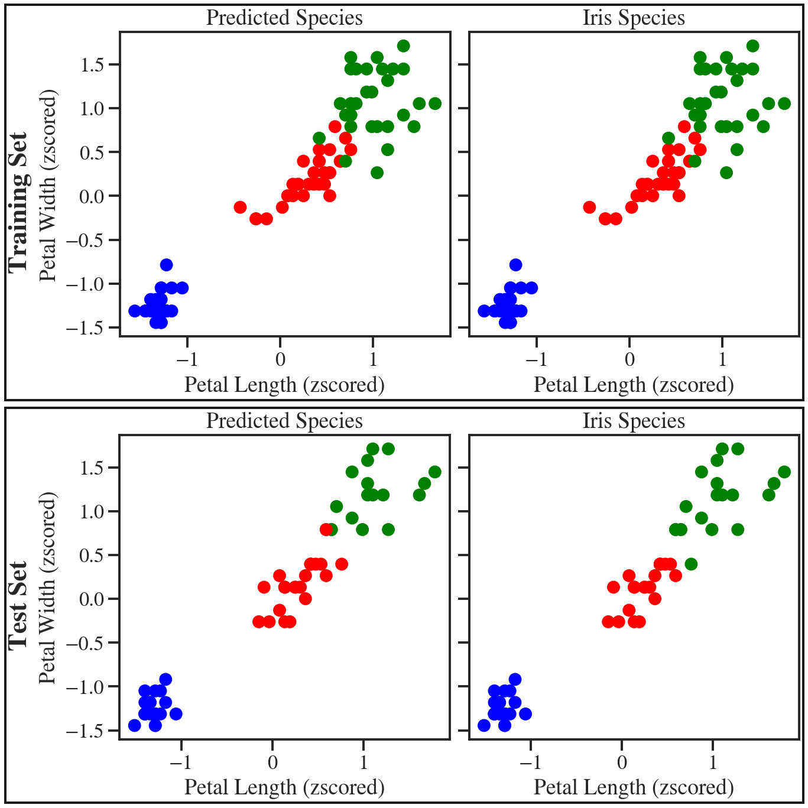

# Iris Dataset

Here, in the companion jupyter [notebook](01_iris_dataset.ipynb), we take a close look at the classical iris dataset. Here, for three different species of Iris, we have measurements of the sepal/petal length/width. The usual data mining goal is to learn how to predict the species of the iris given these 4 measurements.

In the companion [notebook](01_iris_dataset.ipynb), rather than immediately treating the task as a supervised classification problem (which we _do_ at the end), we instead try various (semi-)supervised clustering techniques, and dimensional reduction via PCA, to generate models that can predict the iris species reliably.

When treated as a classification problem, we can use a random forest classifier to get fairly [reliable](#randomforest) predictions.

|  |
|:--------------------------------------------------------------------------------------------------------------------------------------------|
| *Random forest classifier for the iris dataset.*                                                                                            |