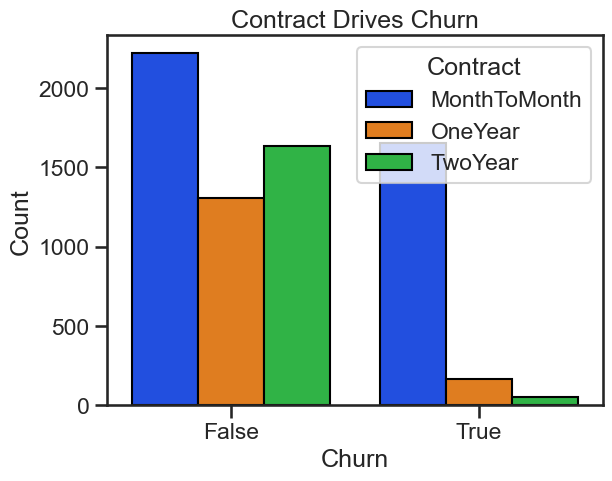
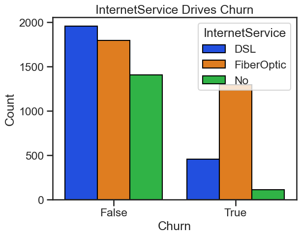

# Business Problem

Telecommunation companies lose significant revenue when customers cancel their subscriptions and possibly switch to competitors - called _churn_.

Challenge: Aquiring new customers is usually more costly than retaining existing customers and improving their LTV.
Objective: Identify top drivers for customer churn, and provide a measure of churn risk so that we can effectively target them for retention.
Business Goal: Enable targeted retention campaigns to reduce churn.

## Data Preparation (ETL)

- Source: Telco Customer Churn dataset (Kaggle)
- Size: $\sim7,000$ customers, $20+$ attributes.
- Features: Contract type, payment method, tenure, internet services, monthly charges, etc.
- Target Variable: Churn (Yes/No). Imbalanced classes with $27\%$ Yes and $73\%$ No.
- Messiness & Fixes: Missing values in TotalCharges, categorical encoding needed for contract/payment methods, outliers in tenure and charges handled. Standardized feature names for easier reading.

# Approach

Since churn is a clearly defined target variable, we can treat the problem as a supervised classification problem with imbalanced classes.

## Exploratory Data Analysis (EAD)

Use mutual information to get an overview of important/unimportant features. Assess Churn characterstics for [top features](#churnmutualinfo):

- Customers with month-to-month contracts churn $\sim14\times$ [more](#eadcontract) than 2-Year contract customers.
- Customers with Fiber Optic internet churn $\sim5\times$ [more](#eadinternetservice) than those without internet service.
- Longer-term customers are less and less likely to churn the longer their tenure grows.

## Modeling

- Logistic regression with correctly scaled numeric features for easy interpretability and speed.
    -  Use classes weighted with base rates.
-  XGBoost with tuned hyper parameters for a generally robust classifier.
    -  Use classes weighted with base rates.
 
For both models, use balanced_accuracy and ROC-AUC as evaluation metrics.

# Results

- Both Logistic Regression and XGBoost perform [similarly](#rocauc) well: ROC-AUC = 0.85
    - Achieved 2$\times$ lift at top 40% as a threshold.
- Deploy Logistic Regression in production for interpretability and speed.
    - Use XGBoost for validating conclusions on test data sets.

## Business Recommendations 

[Primary drivers](#logisticfeatureweights) for churn are month-to-month contracts, monthly charges, fiber-optic internet, and paperless billing. Primary drivers of retention are no internet service, 2-year contracts, total charges. 

- Target month-to-month contract customers with deals to encourage 2-Year contracts.
- Offer discounts/loyalty deals to customers that bundle fiber-optic internet.
- Offer discounts to highest risk customers to  reduce monthly charges.
- Similarly, offer discounts/deals to high risk customers with fiber optic internet service to drive retention.
- Bundle deals with tech support and online security to drive retention.

### Simulated ROI

Target top $40\%$ of the highest-risk customers with discounts/deals or loyalty offers. Assuming that revenue is $50\$/$Customer, and the cost of the ads-campaign is $10\$/$Customer, we can expect a [profit](#profitscurve) of $\approx27.4\$/$Customer if $43.2\%$ of the highest predicted churn customers are targeted, and they all respond positively.

# Appendix

## Preprocessing & Model Training

- For logistic regression, scaled numeric features with a quantile transformer to get feature values closer to a normal distribution.
- One-hot encode the categorical features.
- Split the total data into training (60%) and validation (40%) sets.
- Use Stratified-K-Fold CV for logistic regression.
- Use early stopping in XGBoost by using validation set and 10 steps.

## Feature Importance

|  |
|:--|
| *Assessing potentially important features with mutual information.* |

## EAD

|  |
|:--|
| *Contract type drives churn.* |

|  |
|:--|
| *Internet service type drives churn.* |

## Model Training

### ROC-AUC Analysis

|  |
|:--|
| *Model ROC-AUC.* |

### Lift Curve

|  |
|:--|
| *Model lift curves.* |

## Feature Weights

### Logistic Regression

|  |
|:--|
| *Drivers of retention and churn determined by logistic regression.* |

### XGBoost
|  |
|:--|
| *Drivers of churn determined by xgboost.* Shows agreement with [logistic regression](#logisticfeatureweights).|

## Simulated ROI

|  |
|:---|
| *Simulated Profits Curve.* |
