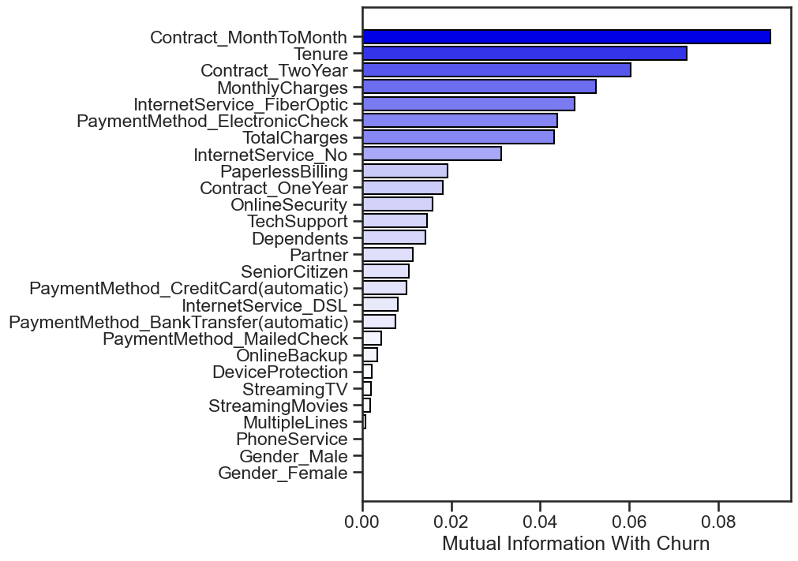
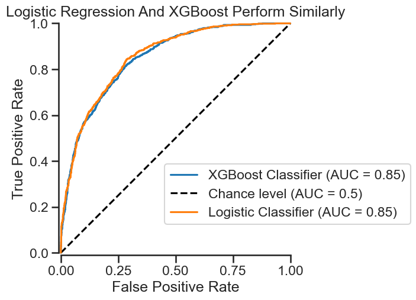
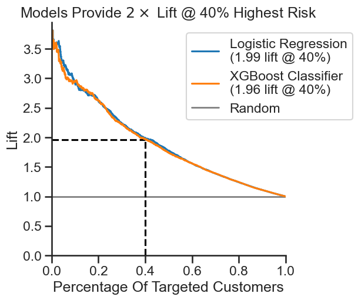
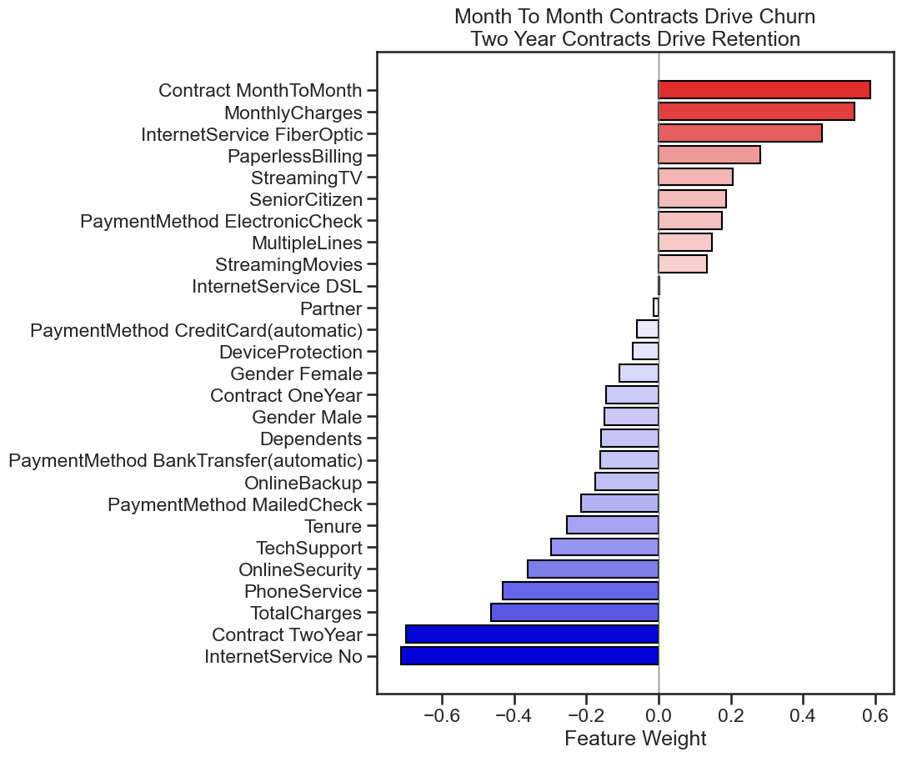
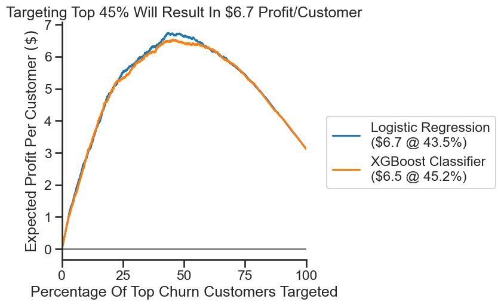

# Introduction

## Business Problem

We want to predict customers who are likely to churn, and identify the top drivers of churn, so that we can target them for retention.

## Data Preparation (ETL)

- Source: Telco Customer Churn dataset (Kaggle)
- Size: $\sim7,000$ customers, $20+$ attributes.
- Features: Contract type, payment method, tenure, internet services, monthly charges, etc.
- Target Variable: Churn (Yes/No). Imbalanced classes with $27\%$ Yes and $73\%$ No.
- Messiness & Fixes: Missing values in TotalCharges, categorical encoding needed for contract/payment methods, outliers in tenure and charges handled. Standardized feature names for easier reading.

# Approach

Treat the data as a classification problem with imbalanced classes.

## Exploratory Data Analysis (EAD)

Use mutual information to get an overview of important/unimportant features. Assess Churn characterstics for [top features](#churnmutualinfo):

- Customers with month-to-month contracts churn $\sim14\times$ more than 2-Year contract customers.
- Customers with Fiber Optic internet churn $\sim5\times$ more than those without internet service.
- Longer-term customers are less and less likely to churn the longer their tenure grows.

## Training Classification Models

## Evaluating Models

# Results

## Business Recommendations 

[Primary drivers](#logisticfeatureweights) for churn are month-to-month contracts, monthly charges, fiber-optic internet, and paperless billing. Primary drivers of retention are no internet service, 2-year contracts, total charges

- Target month-to-month contract customers with deals to encourage 2-Year contracts.
- Offer discounts/loyalty deals to customers that bundle fiber-optic internet.
- Offer discounts to highest risk customers to  reduce monthly charges.
- Similarly, offer discounts/deals to high risk customers with fiber optic internet service to drive retention.
- Bundle deals with tech support and online security to drive retention.

### Simulated ROI

Target top $40\%$ of the highest-risk customers with discounts/deals or loyalty offers. Assuming that revenue is $\pu{50\$/Customer}$, and the cost of the ads-campaign is $\pu{10\$/Customer}$, we can expect a [profit](#profitscurve) of $\approx\pu{27.4\$/Customer}$ if $43.2\%$ of the highest predicted churn customers are targeted.

# Appendix

## Feature Importance

|  |
|:--|
| *Assessing potentially important features with mutual information.* |

## Model Training

### ROC-AUC Analysis

|  |
|:--|
| *Model ROC-AUC.* |

### Lift Curve

|  |
|:--|
| *Model lift curves.* |

## Feature Weights

### Logistic Regression

|  |
|:--|
| *Drivers of retention and churn determined by logistic regression.* |

### XGBoost
|  |
|:--|
| *Drivers of churn determined by xgboost.* Shows agreement with [logistic regression](#logisticfeatureweights).|

## Simulated ROI

|  |
|:---|
| *Simulated Profits Curve.* |
